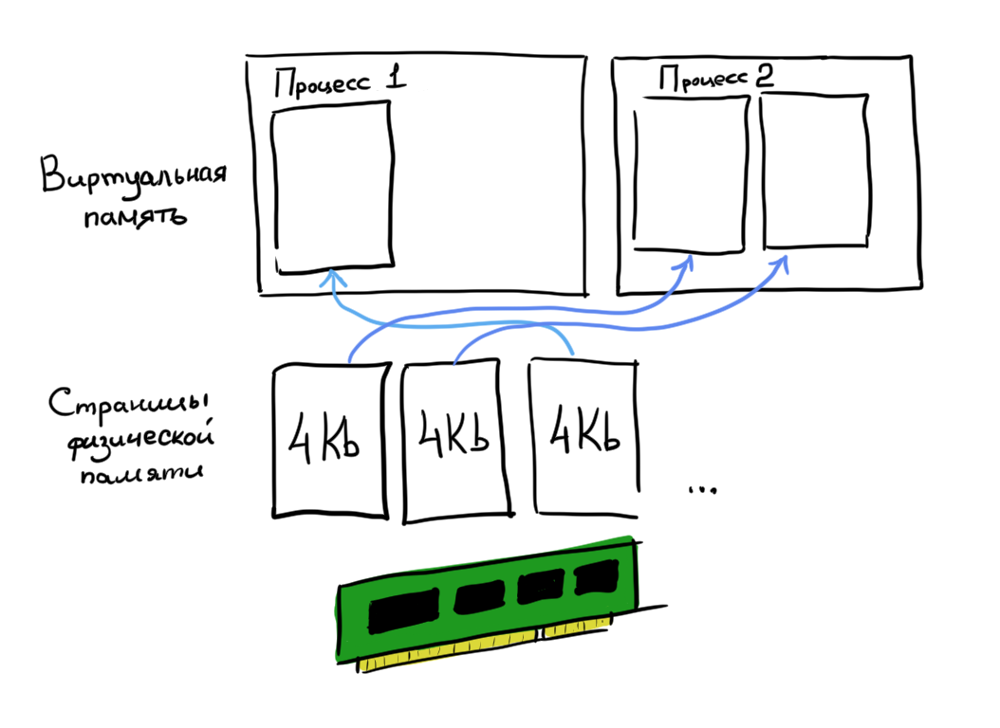
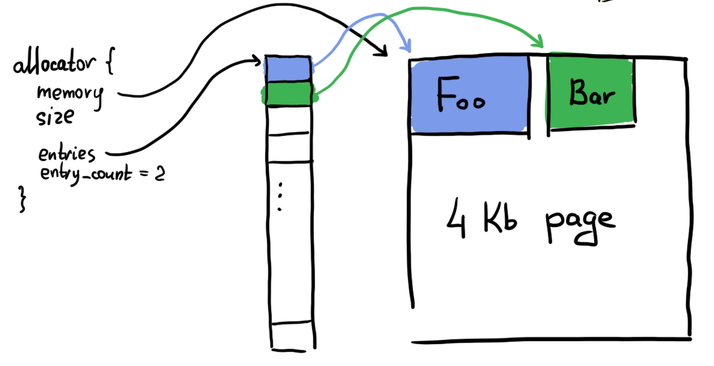
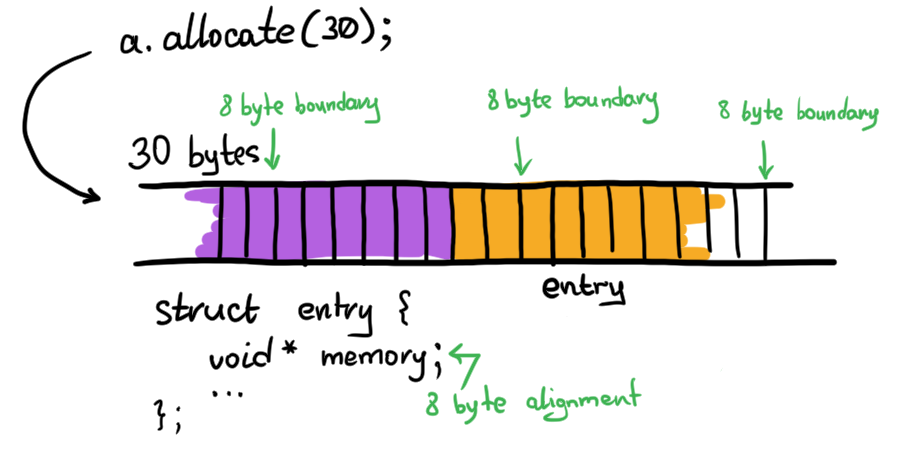

# ЧЕРНОВИК (Аллокатор общего назначения)

Я уже давно хотел сделать свою версию `malloc`, пусть и не такую умную, но зато свою.
К тому как это сделать пришёл не сразу, поэтому хочу записать здесь ход своих мыслей. Надеюсь что вы узнаете здесь что-то новое.

## Память

Давайте начнём с интерфейса. Что вообще представляет из себя аллокатор по типу `malloc`?
Это некая сущность, которая выделяет память, и возвращает обратно в систему, хорошо. Давайте начнём с простой структуры:

```c++
struct allocator {
    void *memory;
    size_t size;
};
```

  - `memory` хранит указатель на начало памяти;
  - `size` это размер блока памяти.

Так, перед началом использования нам нужно будет дать этому аллокатору память, но откуда нам её взять? Снова обращаться к `malloc`?
А откуда вообще берёт память под наши объекты `malloc`? А он её берёт прямиком из операционной системы! В unix-системах это системный вызов [mmap](https://man7.org/linux/man-pages/man2/mmap.2.html), а в Windows [VirtualAlloc](https://docs.microsoft.com/en-us/windows/win32/api/memoryapi/nf-memoryapi-virtualalloc).

```c++
void allocator::initialize(void *memory, size_t size) {
    this->memory = memory;
    this->size = size;
}


int main() {
    size_t size = 1 << 10; // 1 Kb
#ifdef __linux__
    void *memory = mmap(NULL, size, PROT_READ | PROT_WRITE, MAP_PRIVATE | MAP_ANONYMOUS, -1, 0);
#elif _WIN32
    void *memory = VirtualAlloc(NULL, size, MEM_RESERVE | MEM_COMMIT, PAGE_READWRITE);
#endif

    allocator a;
    a.initialize(memory, size);

    return 0;
}
```

<details>
  <summary>Внутри операционной системы...</summary>

Раньше, когда компьютеры были однозадачны, программист не был озадачен проблемами выделения памяти. Процесс на весь компьютер был один, и он владел всей оперативной памятью системы. Сейчас, когда компьютеры стали многозадачными, а железом управляет операционная система, мы не имеем прямого доступа к физической памяти, ведь иначе процессы могли бы изменять память друг друга! Поэтому операционные системы имеют защищённый режим выполнения, и доступ к физической памяти есть только в этом режиме.



Когда мы вызываем VirtualAlloc, Windows переходит в защищённый режим исполнения (kernel-mode), создаёт маппинг между страницами физической памяти, и страницами виртуальной памяти нашего процесса, и выходит обратно в пользовательский режим исполнения (user-mode).
Всё это занимает довольно много времени, поэтому лучше выполнить этот вызов единожды, и работать уже с выданными нам страницами памяти. Для этого нам и нужны аллокаторы!

У страниц виртуальной памяти есть и разрешения, страница может быть нам выдана на чтение, запись, или исполнение - то есть можно будет исполнять код, который находится на этой странице (читатели знакомые с командой `chmod` в линукс легко в этом узнали схожесть с разрешениями на файлы).
Теперь понятно, что же такое этот злосчастный segmentation fault, за который программисты так ругают С++. Это сигнал (или исключение), которое посылает операционная система, если программист обращается к странице памяти, к которой у процесса не выдано соответствующих прав. Например, обратился к странице памяти, которую ОС ему не выдавала.

</details>

Да, платформенный код нам пришлось отделить `ifdef`-ом, но ничего страшного, ведь его всегда можно спрятать за функцией, чью реализацию можно подменить на этапе компиляции, тем самым убрав `ifdef`-ы из общего кода:

## Интерфейс

Наш аллокатор должен уметь выделять и освобождать память. Напишем такой интерфейс.

```c++
void *allocator::allocate(size_t size);
void  allocator::free(void *memory);
```

  - `allocate` принимает размер, который нужно выделить
  - `free` принимает указатель, который вернул аллокатор, и "освобождает" его.

Подождите-ка, что значит освобождает? Не возвращает же аллокатор операционной системе всю страницу полностью? Ведь на ней могут быть и другие данные!
Нужно только пометить, что эта память освобождена, и всё! Ни "освобождать", ни даже заполнять нулями память не нужно.

<details>
<summary>Спойлер</summary>

Поэтому даже после вызова стандартного `free` иногда можно прочитать значения структуры, которая там была до этого, но это UB!

</details>

Стоит сразу указать и на то, что при освобождении памяти, нужно объединять соседние свободные блоки в один! Это нужно, чтобы уменьшить фрагментацию памяти.

## Таблица указателей

Для того чтобы была возможность освобождать память, нам нужно как-то отслеживать, какого размера участки памяти выделены и свободны ли они. Для этого создадим новый тип:

```c++
struct allocator_entry {
    bool occupied;
    size_t size;
};
```

Моей первой наивной мыслью о том как работает аллокатор, была хеш-таблица  `std::unordered_map<void *, allocator_entry>`.
Но такой подход не очень хорошо ложится на моё желание не использовать стандартный аллокатор. К тому же хеш-таблица это довольно сложно, и я не хотел реализовывать ещё и её. Тогда как можно сделать этот маппинг попроще? Массив! А поиск реализовать циклом.

Сказано - сделано. Добавляю в аллокатор массив:

```c++
struct allocator_entry {
    void *memory;
    size_t size;
    bool occupied;
};

constexpr size_t ENTRY_COUNT = 1024;

struct allocator {
    void *memory;
    size_t size;

    allocator_entry entries[ENTRY_COUNT];
    size_t entry_count;
};
```



Такая реализация не подходит, ведь так получается, что больше мы не сможем сделать больше, чем `ENTRY_COUNT` аллокаций. Нам всё равно придётся хранить информацию о размерах блоков памяти динамического размера! Для такой архитектуры я даже реализацию интерфейса делать не буду.

Но где хранить динамический массив? У нас же есть выделенный участок памяти, давайте в нём и хранить! Создам структуру для таблицы, и будет она лежать в начале выделенной памяти, а когда таблица закончится - выделю ещё одну. Таким образом таблицы будут составлять такой связный список.

```
constexpr ENTRY_COUNT = 1024;

struct allocator_entry_table {
    allocator_entry [ENTRY_COUNT];
    allocator_entry_table *next_table;
};
```

Вот только проблема в том, что тогда мы ограничиваем размеры блоков, которые можно выделить, максимальный размер которого будет расстоянием, между двумя таблицами. К тому же, объединить блоки из двух соседних таблиц можно будет только после того, как одна из таблиц окажется пустой, а это очень не эффективно.


Но мы можем хранить `allocator_entry` прямо рядом с аллоцируемой памятью! Так мы сможем объединять рядом стоящие блоки памяти, и наша таблица сможет расти столько, сколько позволяет ей выданный буффер.


Попробуем написать имплементацию для такой архитектуры:

```c++
struct allocator_entry {
    void *memory;
    size_t size;
    bool occupied;
    allocator_entry *next;
};

struct allocator {
    void *memory;
    size_t size;

    allocator_entry first_entry;

    void initialize(void *, size_t);
    void *allocate(size_t);
    void free(void *);
};

void allocator::initialize(void *m, size_t s) {
    memory = m;
    size = s;

    auto *entry = (allocator_entry *) memory;
    entry->memory = (void *) (entry + 1);
    entry->size = size - sizeof(allocator_entry);
    entry->occupied = false;
    entry->next = NULL;
}
```

При инициализации, я сразу создаю в начале блока памяти один `entry`, который будет охватывать весь буффер. При аллокации, я пройдусь по всем блокам памяти, найду подходящий свободный и выделю оттуда участок нужного размера:

```c++
void *allocator::allocate(size_t requested_size) {
    void *result = NULL;

    for (allocator_entry *entry = first_entry;
         entry;
         entry = entry->next)
    {
        if (!entry->is_occupied && entry->size < requested_size) {
            // Allocate memory here
            uint8_t *byte = (uint8_t *) (entry + 1);
            result = byte;

            byte += requested_size;

            allocator_entry *free_entry = (allocator_entry *) byte;
            free_entry->memory = byte + sizeof(allocator_entry);
            free_entry->size = entry->size - requested_size - sizeof(allocator_entry);
            free_entry->occupied = false;
            free_entry->next = entry->next;

            entry->occupied = true;
            entry->next = free_entry;

            break;
        }
    }

    return result;
}
```

## В этом коде сразу несколько серьёзных багов.

### Новые entry могут перекрывать старые


Введём понятие минимального размера блока, и будем требовать, чтобы новый блок появлялся только если оставшейся памяти хватит на ещё одну аллокацию.

```c++
constexpr size_t MIN_BLOCK_SIZE = 8; // bytes;

// ...

if (!entry->is_occupied && entry->size < requested_size) {
    size_t residual_size = entry->size - requested_size;

    if (residual_size >= sizeof(allocator_entry) + MIN_BLOCK_SIZE) {
        // Allocate new free block
        // ...
    } else {
        // Allocate this block completely
        result = entry->memory;
        entry->occupied = true;
    }
}
```

### Память не выровнена

Предположим, мы аллоцируем нашим аллокатором 30 байт. Начало блока памяти будет выровнено, потому что паддниг учитывается в размере структуры. А вот память под новый `entry` будет не выровнена:



Для того чтобы получить выравнивание структуры воспользуемся оператором [alignof](https://en.cppreference.com/w/cpp/language/alignof).
Выравнивание структуры `alignof(allocator_entry) => 8`, а значит `30 % 8 => 6`. То есть предыдущая граница выравнивания была 6 байт назад от конца нашего буффера. Чтобы узнать какой паддинг нам нужно добавить, вычтем из выравнивания полученный остаток: `8 - (30 % 8) => 2`, - значит нам нужно добавить 2 байта паддинга, чтобы попасть на следующую границу выравнивания.
Но что если мы уже на границе выравнивания? Тогда `30 % 8 => 0`, и мы сместимся на 8 байт вперёд, хотя нам не нужно никуда двигаться. Чтобы этого избежать, возьмём остаток от деления ещё раз, получим паддинг `(8 - (30 % 8)) % 8 => 2`.

Упростим наши вычисления тем, что вместо того чтобы каждый раз добавлять паддинг к размеру, договоримся, что аллокатор будет выделять только выровненную память, вместе с паддингом:

```c++
void *allocator::allocate(size_t requested_size) {
    size_t alignment = alignof(allocator_entry);
    size_t padding = (alignment - (requested_size % alignment)) % alignment;
    requested_size += padding;

    // ...
}
```

Давайте реализуем функцию `free`:

```c++
void allocator::free(void *memory_to_free) {
    allocator_entry *prev_entry = NULL;
    for (allocator_entry *entry = first_entry;
         entry;
         entry = entry->next)
    {
        if (entry->memory == memory_to_free) {
            entry->occupied = false;

            if (entry->next && !entry->next->is_occupied) {
                // Next block is free, combine them together
                entry->combine_with_next();
            }
            if (prev_entry && !prev_entry->is_occupied) {
                // Previous block is also free, combine them together
                prev_entry->combine_with_next();
            }

            break;
        }

        prev_entry = entry;
    }
}
```

Здесь я отдаю объединение блоков на метод `combine_with_next`. Указатель на следующий блок я не передаю, потому что он известен самой структуре.

```c++
void allocator_entry::combine_with_next() {
    assert(!occupied && !next->occupied);

    size += next->size + sizeof(allocator_entry);
    next = next->next;
}
```

## Оптимизация

Сейчас, когда аллокатор работает (хоть и не эффективно), можно подумать о вещах, которые можно в нём улучшить, и сделать это довольно просто.

### Указатель на память

Сейчас наша структура `allocator_entry` выглядит так:

```
struct allocator_entry {
    void *memory;
    size_t size;
    bool occupied;
    allocator_entry *next;
};
```

Первое что мне сейчас бросается в глаза: указатель на начало блока. Он нам не нужен, мы же знаем размер и адрес нашего заголовка! Значит можно легко получить указатель на начало блока, просто прибавив размер структуры к адресу. Сделаем для этого метод:

```c++
void *allocator_entry::get_memory_block() {
    return (void *)(this + 1);
}
```

Поскольку `this` имеет тип `allocator_entry *`, то `+1` прибавит к нему размер структуры.

### Указатель на следующий блок

Указатель на следующий блок нам тоже не нужен, ведь мы знаем размер выделенной под блок памяти? К тому же он всегда выровнен.

```c++
allocator_entry *entry = ...;

uint8_t *bytes = (uint8_t *) (entry + 1); // bytes point to the start of memory block
bytes += entry->size; // now bytes point to the next entry

allocator_entry *next_entry = (allocator_entry *) bytes;
```

### Boolean

Это немного более хитрая оптимизация.

```c++
struct {
    size_t size;
    bool occupied;
};
```

Если наша структура выглядит так, то она будет занимать 16 байт! Да, 1 бит `bool`'а добавил целых 7 байт, а всё из-за паддинга.


А мы ведь вполне можем включить этот бит в те 64 бита размера. Да, размер теперь будет 63 бита, но ведь же никто не будет выделять больше, 9223 петабайт памяти в одном блоке, верно?


Для этого нам придётся немножко подвигать битики. Сразу сделаем четыре функции:

```c++
struct allocator_entry {
    uint64_t occupied_and_size_bits;

    uint64_t get_size();
    void set_size(uint64_t);

    bool is_occupied();
    void set_occupied(bool);
}
```

В первых двух функциях мы должны только обнулить самый первый бит в числе, для этого можем воспользоваться тем, что `-1` в дополнительном коде представлена всеми единицами, либо использовать максимальное 64-битное беззнаковое число. Я воспользуюсь `-1`, просто потому что так короче:

```c++
uint64_t allocator_entry::get_size() {
    return occupied_and_size_bits & (-1ULL >> 1);
}

void allocator_entry::set_size(size_t size) {
    assert(size < (-1ULL >> 1));
    occupied_and_size_bits = (occupied_and_size_bits & (1ULL << 63)) | size;
}
```

В `get_size` я обнуляю первый бит - всё остальное это размер. В `set_size` я наоборот, оставляю только первый бит, и выставляю размер в оставшиеся 63 бита. Обратите внимание на `assert`, эта функция не должна никогда вызываться с размером, у которого первый бит выставлен в `1`.

```c++
bool allocator_entry::is_occupied() {
    return occupied_and_size_bits >> 63;
}

void allocator_entry::set_occupied(bool occupied) {
    occupied_and_size_bits = get_size() | (((uint64_t)occupied) << 63);
}
```

Для того чтобы получить первый бит в `is_occupied` достаточно лишь сдвинуть всё число вправо на 63 бита, преобразование в bool произойдёт неявно. В `set_occupied` я использую `get_size`, чтобы получить биты размера без первого, и прибавляю к нему сдвинутый на 63 влево бит аргумента.

Заменив все обращения `entry->size` на `entry->get_size()` и на `entry->set_size(size)`, и аналогичные с `occupied`, мы избавимся от лишних 8 байт, которые несли всего 1 бит информации, и при этом практически не потеряли в функциональности.

#### Избавляемся от цикла

А ведь и правда, зачем он нам нужен? Ведь имея указатель на память, мы вполне можем просто сдвинуться назад на размер заголовка, и освободить его.


К следующему блоку нам перейти тоже не проблема, а вот к предыдущему уже более проблематично. Как быть? Давайте обрамлять выделенный участок памяти с двух сторон. Это вполне сработает.


Сдвигаемся на 8 байт назад чтобы получить наш собственный размер блока. Сдвигаемся на ещё 8 байт назад, чтобы получить размер предыдущего блока. Теперь мы знаем какого размера сам предыдущий блок, и можем сдвинуться ещё пару раз.

```c++
uint8_t *bytes = (uint8_t *) memory_to_free;
allocator_entry *entry = bytes - sizeof(allocator_entry);
uint64_t size = entry->get_size();

uint64_t prev_size = *(uint64_t *)(bytes - 2 * sizeof(allocator_entry));
allocator_entry *prev_entry = (allocator_entry *) (bytes - 3 * sizeof(allocator_entry) - prev_size);
```

## Вывод

Концептуально ничего сложного, но если вы читаете книжки, а не как я пытаетесь создать всё с нуля ничего не зная о предмете :)
И не важно, напишите ли вы свой собственный аллокатор или нет, главное что вы узнали здесь хоть что-то новое.

## Ссылки

  1. [Github: mtrebi/memory-allocators](https://github.com/mtrebi/memory-allocators)
  2. [CppCon 2015: Andrei Alexandrescu “std::allocator...”](https://youtu.be/LIb3L4vKZ7U)
  3. [Habr: Аллокаторы внутри](https://habr.com/ru/post/645137/)
